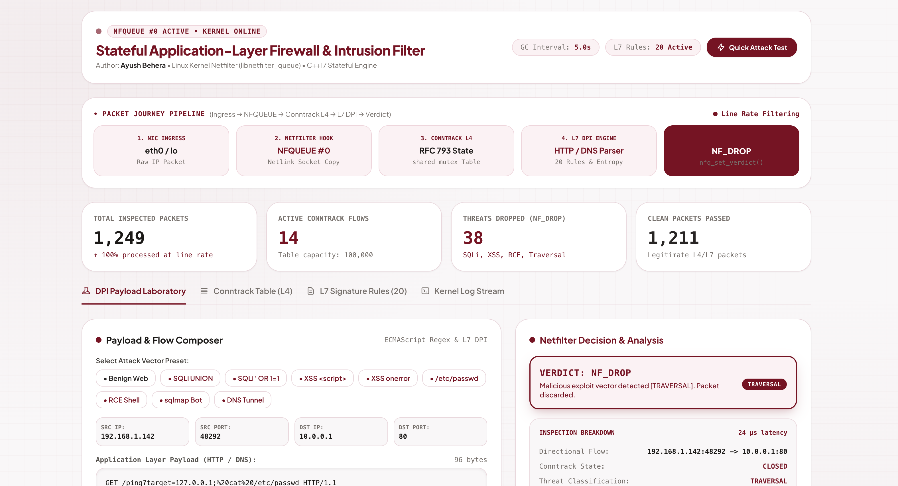
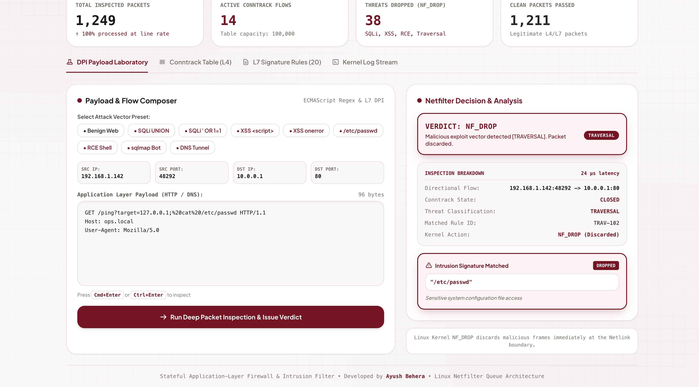
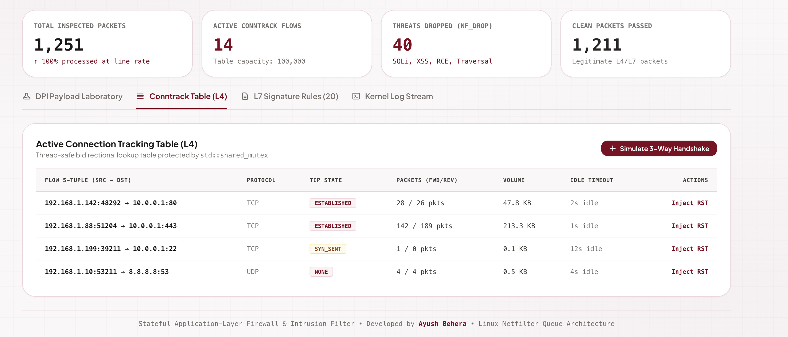
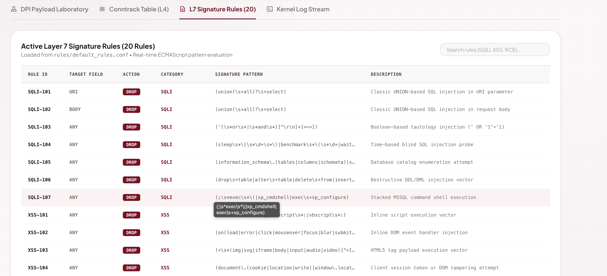
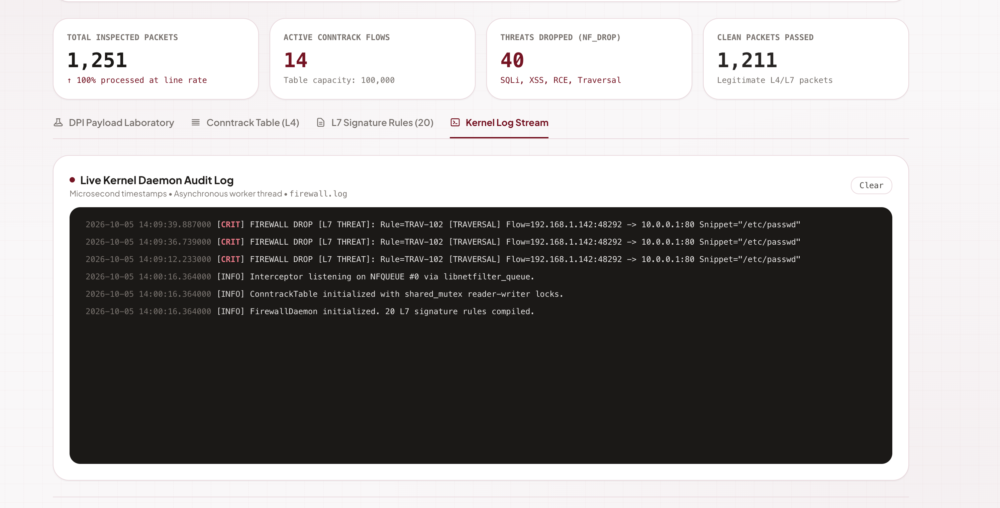

# Stateful Application-Layer Firewall & Intrusion Filter

**Author:** Ayush Behera  
**Target Platform:** Linux (Ubuntu / Debian / RHEL / CentOS / Fedora) with Netfilter (`libnetfilter_queue`)  
**Standard:** C++17 / C++20  

---

## 1. Architectural Overview

The **Stateful Application-Layer Firewall & Intrusion Filter** is a high-performance network security engine designed to operate within the Linux kernel packet filtering framework via `libnetfilter_queue`. It combines **RFC 793 compliant stateful connection tracking** with **Layer 7 Deep Packet Inspection (DPI)** to mitigate network layer anomalies and application layer exploits in real time.

```
                           +------------------------+
                           |  Linux Kernel Netfilter|
                           |   (iptables / NFQUEUE) |
                           +-----------+------------+
                                       |
                                Netlink Socket
                                       v
                     +------------------------------------+
                     |    Interceptor (libnetfilter_queue)|
                     +-----------------+------------------+
                                       |
                             IPv4 / L4 Decoder
                                       |
                    +------------------+------------------+
                    |                                     |
                    v                                     v
       +-------------------------+           +--------------------------+
       | ConntrackTable (L4)     |           | Inspector (L7 DPI)       |
       | - Bidirectional 5-tuple |           | - HTTP Parser & Decoder  |
       | - std::shared_mutex     |           | - DNS Wire & Entropy     |
       | - TCP State Machine     |           | - SQLi / XSS / RCE Regex |
       | - Background GC Thread  |           +------------+-------------+
       +------------+------------+                        |
                    |                                     |
                    +------------------+------------------+
                                       |
                                Verdict Decision
                          (NF_ACCEPT / NF_DROP / ALERT)
                                       |
                     +-----------------+------------------+
                     | Async Logger (Thread-Safe Queue)   |
                     | - Microsecond ISO timestamps       |
                     | - File rotation & console stream   |
                     +------------------------------------+
```

---

## 2. Key Components

### 2.1 Protocol Subsystem (`include/Protocol.h`, `src/Protocol.cpp`)
- **TransportProtocol Enum:** Strongly-typed constants (`TCP = 6`, `UDP = 17`, `ICMP = 1`).
- **TcpState Enum:** Represents states (`NONE`, `SYN_SENT`, `SYN_RECV`, `ESTABLISHED`, `FIN_WAIT`, `CLOSE_WAIT`, `CLOSED`).
- **FlowTuple:** Represents directional 5-tuple (`src_ip`, `dst_ip`, `src_port`, `dst_port`, `protocol`). Includes `reverse()` method for bidirectional tracking and specialized `std::hash<FlowTuple>` using golden-ratio hash combining (`0x9e3779b9`).
- **ConnectionEntry:** Tracks forward/reverse packet and byte counters, timestamps, and idle timeouts.

### 2.2 Asynchronous Logger (`include/Logger.h`, `src/Logger.cpp`)
- **Producer-Consumer Model:** Dedicated worker thread decouples packet processing threads from file I/O operations.
- **Log Levels:** `DEBUG`, `INFO`, `WARNING`, `ERROR`, `CRITICAL`.
- **Microsecond Precision:** High-resolution ISO 8601 timestamps (`YYYY-MM-DD HH:MM:SS.uuuuuu`).
- **Log Rotation:** Automatically rotates logs when exceeding configured size (default 10 MB, keeping 5 backups).
- **ANSI Color Coding:** Visual alerts on interactive terminal consoles.

### 2.3 Stateful Connection Tracker (`include/ConntrackTable.h`, `src/ConntrackTable.cpp`)
- **Concurrency:** Bidirectional hash table protected by `std::shared_mutex` (`std::shared_lock` for read lookups and `std::unique_lock` for state modifications).
- **Handshake Validation:** Enforces strict initial `SYN` validation for new flows, mitigating out-of-order and crafted packet injection.
- **Garbage Collection:** Background daemon thread (`gcCleanupLoop`) periodically sweeps and evicts timed-out half-open or idle connections.

| State | Default Timeout |
|---|---|
| `SYN_SENT` | 30 seconds |
| `SYN_RECV` | 30 seconds |
| `ESTABLISHED` | 3600 seconds (1 hour) |
| `FIN_WAIT` | 60 seconds |
| `CLOSE_WAIT` | 60 seconds |
| `CLOSED` | 10 seconds |
| `UDP` / `ICMP` | 60s / 10s |

### 2.4 Layer 7 Deep Packet Inspector (`include/Inspector.h`, `src/Inspector.cpp`)
- **HTTP Request Inspection:** Parses HTTP method, URI, query parameters, HTTP headers (`User-Agent`, `Cookie`, etc.), and body payloads.
- **URL Normalization:** Implements RFC 3986 percentage-decoding (`%27` -> `'`, `%3C` -> `<`) to foil evasion attacks.
- **DNS Protocol Analyzer:** Decodes raw DNS wire format, parses question labels, enforces RFC length limits (<253 bytes), and calculates **Shannon Entropy** to identify DNS tunneling and exfiltration.
- **Signature Engine:** Evaluates compiled regex rules for:
  - **SQL Injection (SQLi):** `UNION SELECT`, `' OR '1'='1`, `sleep()`, `benchmark()`, `information_schema`, stacked MSSQL execution.
  - **Cross-Site Scripting (XSS):** Inline `<script>`, DOM event handlers (`onerror=`, `onload=`), `javascript:` URIs, client cookie access.
  - **Path Traversal / LFI:** `../`, `..%2f`, `/etc/passwd`, `/etc/shadow`, `boot.ini`.
  - **Remote Code Execution (RCE):** Shell command chaining (`; cat /etc/passwd`, `$(whoami)`, reverse shells).
  - **Malicious Bots:** Fingerprints scanners such as `sqlmap`, `nikto`, `dirbuster`, `nmap`.

### 2.5 Netfilter Interceptor (`include/Interceptor.h`, `src/Interceptor.cpp`)
- **libnetfilter_queue Integration:** Netlink socket setup, kernel queue binding, and verdict dispatching (`NF_ACCEPT`, `NF_DROP`).
- **RAII Lifecycle:** Encapsulates queue handles, socket descriptors, and packet dispatchers.
- **Portable Packet Decoding:** Endian-safe, alignment-safe IPv4 and L4 parsing.

### 2.6 Daemon Orchestrator & Entry Point (`include/FirewallDaemon.h`, `src/main.cpp`)
- **Lifecycle Management:** Orchestrates logger, inspector, conntrack, and interceptor subsystems.
- **Graceful Signal Handling:** Handles `SIGINT` and `SIGTERM` to unbind Netfilter queues, drain asynchronous loggers, and exit cleanly without dropping system networking.
- **Dynamic Rule Reloading:** Supports `SIGHUP` to hot-reload signature files without daemon restarts.

---

## 3. Directory Layout

```
stateful_firewall/
├── CMakeLists.txt              # Modern CMake build configuration
├── README.md                   # Architecture & documentation
├── include/                    # Header files
│   ├── ConntrackTable.h
│   ├── FirewallDaemon.h
│   ├── Inspector.h
│   ├── Interceptor.h
│   ├── Logger.h
│   └── Protocol.h
├── src/                        # Implementation files
│   ├── ConntrackTable.cpp
│   ├── FirewallDaemon.cpp
│   ├── Inspector.cpp
│   ├── Interceptor.cpp
│   ├── Logger.cpp
│   ├── Protocol.cpp
│   └── main.cpp
├── rules/                      # Signature rules
│   └── default_rules.conf
├── scripts/                    # Deployment & testing utilities
│   ├── deploy.sh               # Root-privileged deployment & iptables setup
│   └── test_traffic.py         # Malicious / benign traffic generator
└── tests/                      # Unit & integration test suite
    └── test_firewall.cpp
```

---

## 4. Build & Installation

### 4.1 System Prerequisites (Linux)
On Debian / Ubuntu:
```bash
sudo apt-get update
sudo apt-get install -y build-essential cmake pkg-config \
                        libnetfilter-queue-dev libnfnetlink-dev iptables
```

On RHEL / CentOS / Fedora:
```bash
sudo dnf install -y gcc-c++ make cmake pkgconf-pkg-config \
                    libnetfilter_queue-devel libnfnetlink-devel iptables
```

### 4.2 Building with CMake
```bash
mkdir -p build && cd build
cmake -DCMAKE_BUILD_TYPE=Release ..
cmake --build . -j$(nproc)
```

The resulting binaries will be placed in the `bin/` directory:
- `bin/stateful_firewall`: Main firewall daemon.
- `bin/firewall_tests`: Standalone verification test suite.

---

## 5. Running Tests

Execute the unit and integration test suite:
```bash
./bin/firewall_tests
```

Sample output:
```
====================================================
   STATEFUL FIREWALL UNIT & INTEGRATION TEST SUITE
====================================================

=== Running Protocol & Hashing Tests ===
[PASSED] IPv4 string conversion
[PASSED] IPv4 destination string conversion
[PASSED] Tuple reverse IP logic
[PASSED] Tuple reverse Port logic
[PASSED] Hash consistency for identical tuples
[PASSED] Hash distinction for reverse flows
[PASSED] Connection forward counters
[PASSED] Connection reverse counters

=== Running Conntrack State Machine Tests ===
[PASSED] Reject out-of-state ACK on unestablished flow
[PASSED] Client initial SYN registers NEW_FLOW
[PASSED] State is SYN_SENT
[PASSED] Bidirectional conntrack lookup points to same entry
[PASSED] Server SYN-ACK transitions state
[PASSED] State is SYN_RECV
[PASSED] Client ACK completes 3-way handshake
[PASSED] State is ESTABLISHED
[PASSED] Established data transfer accepted
[PASSED] Client FIN transitions to FIN_WAIT
[PASSED] State is FIN_WAIT
[PASSED] Mutual FIN closes connection
[PASSED] State is CLOSED

=== Running L7 Inspector (HTTP & Signatures) Tests ===
[PASSED] Benign HTTP Request allowed
[PASSED] SQLi UNION SELECT detected & dropped
[PASSED] Threat category is SQLI
[PASSED] SQLi Boolean tautology detected & dropped
[PASSED] XSS script tag detected & dropped
[PASSED] Path traversal detected & dropped
[PASSED] Malicious scanner User-Agent detected

=== Running L7 Inspector (DNS & Tunneling) Tests ===
[PASSED] Standard DNS query accepted
[PASSED] High entropy DNS tunneling detected & blocked

=== Running Packet Decoder Tests ===
[PASSED] Packet decoding succeeded
[PASSED] Protocol is TCP
[PASSED] Ports match expected 8080 -> 80
[PASSED] Flags match SYN
[PASSED] Payload length correctly calculated

====================================================
   ALL TEST SUITES PASSED SUCCESSFULLY (100% OK)
====================================================
```

---

## 6. Automated Linux Deployment

The deployment script `scripts/deploy.sh` verifies root privileges, installs dependencies, builds the binary, registers Netfilter iptables hooks, and runs the daemon. When stopped (`Ctrl+C`), it automatically detaches iptables hooks via a bash signal trap.

```bash
sudo ./scripts/deploy.sh [queue_num] [rules_file]
```

### Manual iptables NFQUEUE Setup
If running manually:
```bash
# Direct inbound TCP and DNS to queue 0
sudo iptables -I INPUT -p tcp -j NFQUEUE --queue-num 0
sudo iptables -I INPUT -p udp --dport 53 -j NFQUEUE --queue-num 0
sudo iptables -I OUTPUT -p udp --dport 53 -j NFQUEUE --queue-num 0

# Start Daemon
sudo ./bin/stateful_firewall --queue-num 0 --rules rules/default_rules.conf --log-level INFO

# Remove rules on shutdown
sudo iptables -D INPUT -p tcp -j NFQUEUE --queue-num 0
sudo iptables -D INPUT -p udp --dport 53 -j NFQUEUE --queue-num 0
sudo iptables -D OUTPUT -p udp --dport 53 -j NFQUEUE --queue-num 0
```

---

## 7. Testing with Traffic Generator

With the firewall daemon active, run the test traffic generator in another terminal:
```bash
python3 scripts/test_traffic.py --host 127.0.0.1 --port 80
```
Check `firewall.log` to view real-time intrusion drop logs:
```bash
tail -f firewall.log
```
2026-09-30 18:25:52.412951 [CRIT] [Interceptor.cpp:241] FIREWALL DROP [L7 THREAT]: Rule=SQLI-101 [SQLI] Flow=127.0.0.1:45124 -> 127.0.0.1:80 [TCP] Snippet="UNION SELECT"
```

---

## 8. Interactive Web Dashboard & Live DPI Console

The project includes an interactive web console for monitoring firewall telemetry, visualizing the packet journey pipeline, and testing deep packet inspection vectors against the 20 active L7 signatures:

- **Full Dashboard**: [`dashboard.html`](dashboard.html) — Displays real-time KPIs, packet journey pipeline (NIC $\to$ Netfilter $\to$ Conntrack $\to$ L7 DPI $\to$ Verdict), live connection tracking table, active signatures browser, and interactive payload tester with attack presets (SQLi, XSS, Path Traversal, RCE, User-Agent Scanner, DNS Tunneling).
- **Embedded Widget**: [`widget.html`](widget.html) — Compact, embeddable DPI testing console styled in Maroon & White Light Mode.

To view the dashboard, open `dashboard.html` in any modern web browser:
```bash
open dashboard.html       # macOS
xdg-open dashboard.html   # Linux
```

---

## 9. Project Images & Screenshots

This section showcases the key interfaces, firewall architecture, intrusion detection capabilities, and testing results of the **Stateful Application-Layer Firewall & Intrusion Filter**.

### 9.1 Project Image Gallery

#### Image 1: Main Firewall Dashboard


#### Image 2: Live Packet Monitoring


#### Image 3: Deep Packet Inspection (DPI)


#### Image 4: Intrusion Detection and Threat Alerts


#### Image 5: Firewall Testing and Results


---
